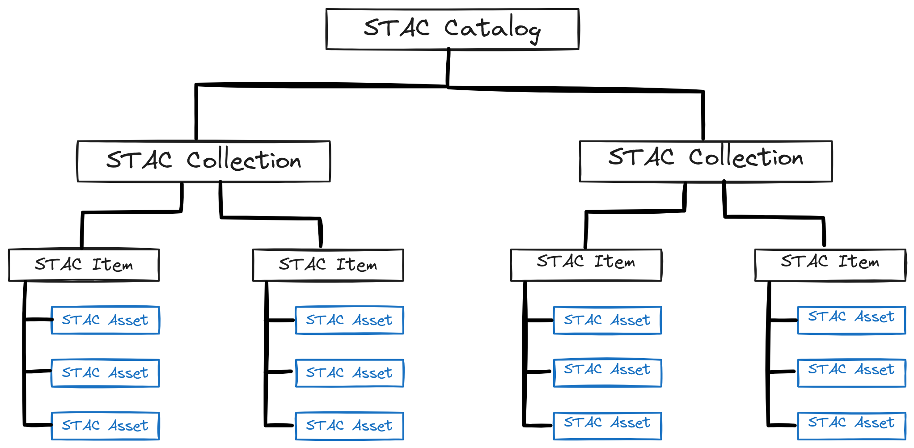
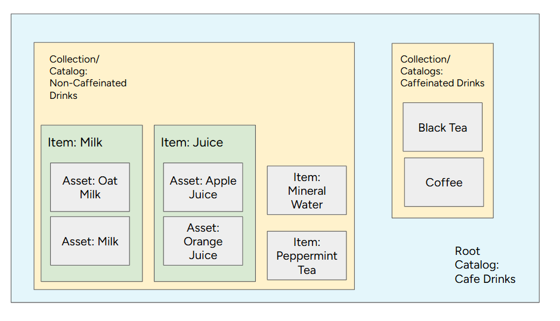

::: {.justify}

The **SpatioTemporal Asset Catalog** [(STAC)](https://stacspec.org/en/) is a community-driven standard designed to organise and present geospatial data in a unified manner using the JSON format.  
Its foundation lies in the GeoJSON layout, which allows geodata to be extended to adapt to various identification needs. This flexibility enables the STAC specification to be highly adaptable.

The primary goal of STAC is to allow data providers to share their data globally, making it easier for users to understand the where, when, how, and what of retrieved information.  
By creating a global index and promoting interoperability, data from diverse products and missions can be searched efficiently. This also supports web best practices, making geospatial information more discoverable through traditional search engines.

The STAC standard offers various resources and tools for accessing, managing, and building catalogues that follow the STAC standard. These include:

- [STAC Browser](https://github.com/radiantearth/stac-browser)
- [STAC Server](https://github.com/stac-utils/stac-server)
- [STAC Validator](https://github.com/stac-utils/stac-validator), [PySTAC](https://github.com/stac-utils/pystac), and [EODAG](https://github.com/CS-SI/eodag) (for Python users)
- [rstac](https://github.com/brazil-data-cube/rstac) (for R users)
- [STAC.jl](https://github.com/JuliaClimate/STAC.jl), [STACCube.jl](https://github.com/felixcremer/STACCube.jl) (for Julia users)

A structure allowing the browsing of Items within STAC, along with their associated metadata, can be described as:

`{` 
`    "stac_version": "1.0.0",` 
`    "type": "Feature",` 
`    "id": "20201211_223832_CS2",` 
`    "bbox": [],` 
`    "geometry": {},` 
`    "properties": {},` 
`    "collection": "simple-collection",` 
`    "links": [],` 
`    "assets": {}` 
`} ` 

The key components that establish a STAC in an unified structure are:

- **Catalogue**: serves as the initial entry point within a STAC. Within a Catalogue, a `.json` file provides links to further Collections or Items contained within that Catalogue.

- **Collection**: expands upon the parent Catalogue's metadata by identifying the **Items** it contains, addressing their spatial and temporal extent. Additionally, information such as licenses, keywords, and data providers further specifies details for retrieving particular Items.   It is important to note that when users are searching for data, it is generally recommended to use **Collections as the starting point**; on the other hand, **Catalogues primarily serve the purpose of structuring and grouping data**. This distinction helps us get a structured overview, as the terms are sometimes used interchangeably within the field.

- **Item**: is the fundamental element of STAC. It is a `.GeoJSON` feature supplemented with additional metadata, enabling browsing through catalogues. This allows it to be easily read by any modern Geographic Information System (GIS) or geospatial library.

- **Asset**: The most granular element in a STAC is a SpatioTemporal Asset. This refers to any file that represents specific geographic information at a specific place and time. At this level, the GeoJSON does not contain the actual information itself; rather, it provides references to these files, functioning similarly to an index for each of the STAC Assets.

These elements are related to each other as containers. A STAC can be defined as a group of links that lead to Items, smaller Catalogues, and Collections. Items are always composed of Assets. A Collection can be viewed as a group of Catalogues, with additional information that provides deeper insight into the contained data.

{fig-align="center"}

To better understand it, imagine the entire **Cafe Drinks** menu as a STAC Catalogue. This catalogue is the top-level entry point, presenting the overall selection of beverages available.

Within this Cafe Drinks Catalogue, we find major sections or categories. These sections represent Collections in STAC.  
For our analogy, let's say the menu is divided into two main collections:

- **Caffeinated Drinks Collection**: This section groups all beverages that contain caffeine. 
- **Non-Caffeinated Drinks Collection**: This section groups all beverages that do not contain caffeine.

Each of these Collections then contains specific drinks, which can then be grouped into items. 
An Item is a distinct, like a group of drinks, and inside, we define Black Tea, Juice or Milk. Each Item would have its description, ingredients or type, and perhaps a picture. 
This example has a similar structure to a STAC has metadata inside, like the date and time of observation, and the geographic area it covers. 

{fig-align="center"}

Finally, at the most granular level, each Item is made up of Assets. These are the individual components or files that constitute the Item. For example:

For the Milk Item (found in the Non-Caffeinated Drinks Collection), its Assets might include:

- Oat Milk
- Regular Milk

Also, an Item Juice with:

- Apple Juice
- Orange Juice

This structure allows us to easily navigate a vast amount of data, just as a well-organised menu helps a customer quickly find their desired drink.

As we've explored, the **SpatioTemporal Asset Catalog** offers a strong and adaptable framework for geographic data organisation. Large volumes of spatiotemporal data may be effectively defined, indexed, and found thanks to STAC's hierarchical structure, which extends from the overall Catalogue to individual Assets.

::: {.callout-note}
To explore further resources for STAC and further EOPF developments, stay tuned through the [STAC documentation](https://stacspec.org/en/) updates.
:::

In the following chapters, we will explore how to access the [EOPF Sentinel Zarr Samples Service STAC API](https://stac.browser.user.eopf.eodc.eu/?.language=en), the STAC where the `zarr` samples for Sentinel 1, Sentinel 2 and Sentinel 3 are made available by ESA.  

We will also explore how to browse the data, download samples and access assets metadata through several programming languages and plugins.

:::