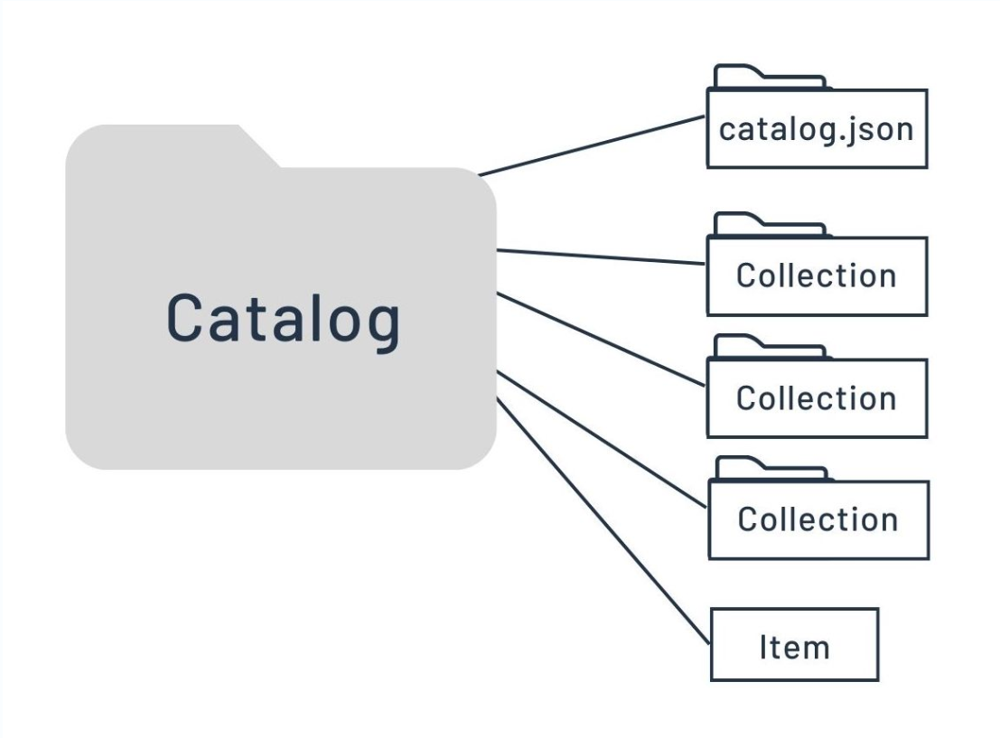

::: {.justify}

### Introduction

The **S**patio-**T**emporal **A**sset **C**atalog is a standardised way to catalog and describe geospatial (raster) data. STAC makes it easier to discover, access, and work with geospatial data, in particular satellite data, as it provides a **common language for describing spatial and temporal characteristics** of the data. 
This common language improves interoperability between different data providers and software tools.

### What we will learn

- 🔍 What STAC is and why it's important?
- 🌳 Identify the STAC environment
- 🪜📊 Understand STACs hierarchical structure

## Foundation

The main goal of [STAC](https://stacspec.org/en/) is to allow data providers share their data easily, making it universal for users to understand the where, when, how, and what of the collected data.  
STACs foundation lies in the **GeoJSON** layout, that allows geodata to be extended and adapted to various needs. This flexibility enables the STAC specification to be versatile accross analysis and visualisation workflows. 
By creating a global index and enhancing interoperability, data from diverse products and missions can be searched efficiently. This also supports web best practices, making geospatial information more discoverable through traditional search engines.

## Available Resources

The STAC standard offers various resources and tools for accessing, managing, and building catalogues that follow the STAC standard. These include:

- [STAC Browser](https://github.com/radiantearth/stac-browser)
- [STAC Server](https://github.com/stac-utils/stac-server)
- [STAC Validator](https://github.com/stac-utils/stac-validator), [PySTAC](https://github.com/stac-utils/pystac), and [EODAG](https://github.com/CS-SI/eodag) (for Python users)
- [rstac](https://github.com/brazil-data-cube/rstac) (for R users)
- [STAC.jl](https://github.com/JuliaClimate/STAC.jl), [STACCube.jl](https://github.com/felixcremer/STACCube.jl) (for Julia users)

## STAC structure

The structure that enables the identification of each catalogue within STAC (the starting point for a dataset), along with its associated first-level metadata, can be described as follows:

`{` 
`    "stac_version": "1.0.0",` 
`    "type": "Feature",` 
`    "id": "20201211_223832_CS2",` 
`    "bbox": [],` 
`    "geometry": {},` 
`    "properties": {},` 
`    "collection": "simple-collection",` 
`    "links": [],` 
`    "assets": {}` 
`} ` 

The key components that establish a STAC in an unified and structured form are:

#### Catalog
A catalogue serves as the initial entry point in a STAC. Within a Catalogue, a `.json` file provides links to further Collections or Items contained within that Catalogue. 
When searching for specific data, such as all the observations from a particular instrument or mission, it is usually best to start with STAC collections.

#### Collection
It expand upon the parent Catalogue's metadata. They allow the identification of the **Items** it contains, addressing their spatial and temporal extent. They also group items based on their origin or topic  
Also, information such as licenses, keywords, and data providers further specify details that allow the particular Items search.  

{fig-align="center"}

::: {.callout-note}
Although a catalogue can sometimes serve as a collection, its primary role is to organise and structure data within the overall STAC hierarchy. Collections, on the other hand, are designed to provide a more detailed grouping of related data assets with additional descriptions. 
Recognising this distinction is essential for effectively navigating the STAC ecosystem, particularly since the terms **catalogue** and **collection** are sometimes used interchangeably in this field.
:::

#### Item
An item is the fundamental element of STAC. It is a `.GeoJSON` feature supplemented with additional metadata, enabling browsing through catalogues. This allows it to be easily read by any modern Geographic Information System (GIS) or geospatial library.

{fig-align="center"}

#### Asset
Composes the most granular element in a STAC: a **SpatioTemporal Asset**. This refers to any file that represents specific geographic information at a specific place and time. 
At this level, the GeoJSON does not contain the actual information itself; rather, it provides references to these files, functioning similarly to an index for each of the STAC Assets.

These elements are related to each other as containers. A STAC can be defined as a group of links that lead to Items, smaller Catalogues, and Collections. Items are always composed of Assets. A Collection can be viewed as a group of Catalogues, with additional information that provides deeper insight into the contained data.

{fig-align="center"}

## ☕️ Cafe Menu

To better understand how the elements are nested within a STAC, imagine a **Cafe Drinks** menu as a STAC.  
This catalogue is the top-level entry point, presenting the overall selection of beverages available. 

Within this Cafe Drinks **catalogue**, we find major sections or categories. These sections represent **collections** in STAC.  
For our analogy, let's say the menu is divided into two main collections:

- **Caffeinated Drinks Collection**: This section groups all beverages that contain caffeine. 
- **Non-Caffeinated Drinks Collection**: This section groups all beverages that do not contain caffeine. 

Each of these collections contains specific drinks, which can then be grouped into **items**. 
For our distinction, like a group of drinks, we define:

- Black Tea
- Juice 
- Milk

Each item will have its description, ingredients or type. This example has a similar structure to a STAC with metadata inside, like the date and time of observation, and the geographic area it covers. 

Finally, at the most granular level, each Item is made up of Assets. These are the individual components or files that constitute the Item. For example:

For the **Milk item** (found in the Non-Caffeinated Drinks Collection), its Assets might include:

- Oat Milk
- Regular Milk

Also, an **Juice item** with:

- Apple Juice
- Orange Juice

This structure allows us to easily navigate a vast amount of data, just as a well-organised menu helps a customer quickly find their desired drink.

{fig-align="center"}

::: {.callout-note}
To explore further resources for STAC and further EOPF developments, stay tuned through the [STAC documentation](https://stacspec.org/en/) updates.
:::

## Conclusion

As we have explored, the **Spatio-Temporal Asset Catalog** offers a strong and adaptable framework for geographic data organisation. Large volumes of spatiotemporal data may be effectively defined, indexed, and found thanks to STAC's hierarchical structure, which extends from the overall Catalogue to individual Assets.

## What's next?

In the following chapters, we will explore how to access the [EOPF Sentinel Zarr Samples Service STAC API](https://stac.browser.user.eopf.eodc.eu/?.language=en), the STAC where the `zarr` samples for Sentinel 1, Sentinel 2 and Sentinel 3 are made available by ESA.  

We will also explore how to browse the data, download samples and access assets metadata through several programming languages and plugins.