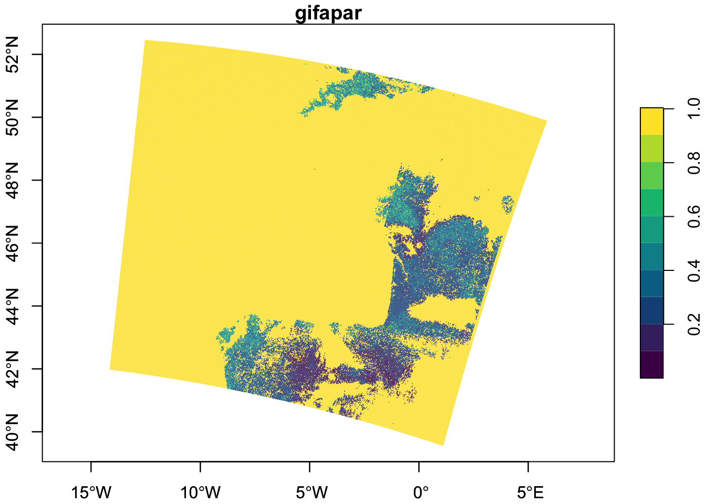

```{r setup, echo = FALSE}
options(scipen = 999)

link_start <- "https://jupyterhub.user.eopf.eodc.eu/hub/login?next=%2Fhub%2Fspawn%3Fnext%3D%252Fhub%252Fuser-redirect%252Fgit-pull%253Frepo%253Dhttps%253A%252F%252Fgithub.com%252Feopf-toolkit%252Feopf-101%2526branch%253Dmain%2526urlpath%253Dlab%252Ftree%252Feopf-101%252F"
folder <- "05_zarr_tools"
separator <- "%252F"
file <- "54_eopf_zarr_r_examples.ipynb"
link_end <- "%23fancy-forms-config=%7B%22profile%22%3A%22choose-your-environment%22%2C%22image%22%3A%22unlisted_choice%22%2C%22image%3Aunlisted_choice%22%3A%224zm3809f.c1.de1.container-registry.ovh.net%2Feopf-toolkit-r%2Feopf-toolkit-r%3Alatest%22%2C%22autoStart%22%3A%22true%22%7D"

jupyterlab_link <- paste0(link_start, folder, separator, file, link_end)
```

<a href="`r jupyterlab_link`" target="_blank">
<button style="background-color:#0072ce; color:white; padding:0.6em 1.2em; font-size:1rem; border:none; border-radius:6px; margin-top:1em;">
🚀 Launch this notebook in JupyterLab
</button>
</a>

**By:** *[@sharlagelfand](https://github.com/sharlagelfand)*

## Introduction

This tutorial expands on the previous tutorials ([Access the EOPF Zarr STAC API with R](https://eopf-toolkit.github.io/eopf-101/05_zarr_tools/51_eopf_stac_r.html) and [Access and analyse EOPF STAC Zarr data with R](https://eopf-toolkit.github.io/eopf-101/05_zarr_tools/53_eopf_zarr_r.html)), going into further details on analysing and visualising Zarr data from the [EOPF Sample Service STAC catalog](https://stac.browser.user.eopf.eodc.eu/) programmatically using R. We recommend reviewing the previous tutorials if you have not done so already.

## What we will learn

- 🗂 How to extract measurements, such as Ocean Wind field and GIFAPAR, along with latitude and longitude
- 🔎 How to open and visualise quicklook composite images
- 📊 How to format, scale, and visualise satellite data on a curvillinear grid

## Prerequisites

An R environment is required to follow this tutorial, with R version >= 4.5.0. We recommend using either [RStudio](https://posit.co/download/rstudio-desktop/) or [Positron](https://posit.co/products/ide/positron/) (or a cloud computing environment) and making use of [RStudio projects](https://support.posit.co/hc/en-us/articles/200526207-Using-RStudio-Projects) for a self-contained coding environment.

### Dependencies

We will use the following packages in this tutorial:

- [`rstac`](https://brazil-data-cube.github.io/rstac/) (for accessing the STAC catalog)
- [`tidyverse`](https://tidyverse.tidyverse.org/) (for data manipulation)
- [`stars`](https://r-spatial.github.io/stars/)) (for working with spatiotemporal data)
- [`terra`](https://rspatial.github.io/terra/index.html) (for working with spatial - data in raster format)

You can install them directly from CRAN:

```{r install}
# install.packages("rstac")
# install.packages("tidyverse")
# install.packages("stars")
# install.packages("terra")
```

We will also use the `Rarr` package (version >= 1.10.1) to read Zarr data. It must be installed from Bioconductor, so first install the `BiocManager` package:

```{r install-BiocManager}
# install.packages("BiocManager")
```

Then, use this package to install `Rarr`:

```{r install-rarr}
# BiocManager::install("Rarr")
```

Finally, load the packages into your environment:

```{r load, message=FALSE, cache = FALSE}
library(rstac)
library(tidyverse)
library(Rarr)
library(stars)
library(terra)
```

## Sentinel-1

The first example looks at [Sentinel-1 Level 2 Ocean (OCN) data](https://stac.browser.user.eopf.eodc.eu/collections/sentinel-1-l2-ocn), which consists of data for oceanographic study, such as monitoring sea surface conditions, detecting oil spills, and studying ocean currents. This example will show how to access and plot Wind Direction data.

First, select the relevant collection and item from STAC:

```{r sentinel-1-stac}
l2_ocn <- stac("https://stac.core.eopf.eodc.eu/") |>
  collections(collection_id = "sentinel-1-l2-ocn") |>
  items(feature_id = "S1C_IW_OCN__2SDH_20250921T194014_20250921T194043_004227_008634_1302") |>
  get_request()

l2_ocn
```

We can look at each of the assets' titles to understand what the item contains:

```{r l2-ocn-assets}
l2_ocn |>
  pluck("assets") |>
  map("title")
```

We are interested in the "Ocean Wind field" data, and will hold onto the `owi` key for now.

To access all of the `owi` data, we get the "product" asset and then the full Zarr store, again using our helper function from the previous tutorial to extract array information from the full array path:

```{r l2-ocn-store}
derive_store_array <- function(store, product_url) {
  store |>
    mutate(array = str_remove(path, product_url)) |>
    relocate(array, .before = path)
}

l2_ocn_url <- l2_ocn |>
  assets_select(asset_names = "product") |>
  assets_url()

l2_ocn_store <- l2_ocn_url |>
  zarr_overview(as_data_frame = TRUE) |>
  derive_store_array(l2_ocn_url)

l2_ocn_store
```

Next, we filter to access `owi` measurement data only:

```{r owi-filter}
l2_ocn_store |>
  filter(str_starts(array, "/owi"), str_detect(array, "measurements"))
```

Since all of these arrays start with a long ID, we can remove that to get a clearer idea of what each array is:

```{r owi-arrays}
owi <- l2_ocn_store |>
  filter(str_starts(array, "/owi"), str_detect(array, "measurements"))

array_id_prefix <- str_split(owi[["array"]], "measurements", simplify = TRUE)[, 1] |>
  unique()

array_id_prefix

array_id_prefix <- paste0(array_id_prefix, "measurements/")

owi <- owi |>
  mutate(array = str_remove(array, array_id_prefix))

owi
```

We are interested in `wind_direction`, as well as the coordinate arrays (`latitude` and `longitude`). We can get an overview of the arrays' dimensions and structures:

```{r owi-overview}
owi |>
  filter(array == "wind_direction") |>
  pull(path) |>
  zarr_overview()

owi |>
  filter(array == "latitude") |>
  pull(path) |>
  zarr_overview()

owi |>
  filter(array == "longitude") |>
  pull(path) |>
  zarr_overview()
```

Here, we can see that all of the arrays are of the same shape: 194 x 254, with only one chunk. Since these are small, we can read all of the data in at once.

```{r owi-read}
owi_wind_direction <- owi |>
  filter(array == "wind_direction") |>
  pull(path) |>
  read_zarr_array()

owi_wind_direction[1:5, 1:5]

owi_lat <- owi |>
  filter(array == "latitude") |>
  pull(path) |>
  read_zarr_array()

owi_lat[1:5, 1:5]

owi_long <- owi |>
  filter(array == "longitude") |>
  pull(path) |>
  read_zarr_array()

owi_lat[1:5, 1:5]
```

As described in the previous R tutorial, Zarr data arrays are often packed or compressed in order to limit space, and may need to be scaled or offset to their actual physical units or meaningful values. 

This information is contained in the metadata associated with the Zarr store. We created a helper function to obtain these values, setting the `offset` to 0 and `scale` to 1 if they do not need to be offset or scaled.

```{r scale-factor-offset}
get_scale_and_offset <- function(zarr_url, array) {
  metadata <- Rarr:::.read_zmetadata(
    zarr_url,
    s3_client = Rarr:::.create_s3_client(zarr_url)
  )

  metadata <- metadata[["metadata"]]

  array_metadata <- metadata[[paste0(array, "/.zattrs")]]

  scale <- array_metadata[["scale_factor"]]
  scale <- ifelse(is.null(scale), 1, scale)

  offset <- array_metadata[["add_offset"]]
  offset <- ifelse(is.null(offset), 0, offset)


  list(
    scale = scale,
    offset = offset
  )
}

get_scale_and_offset(l2_ocn_url, paste0(array_id_prefix, "wind_direction"))

get_scale_and_offset(l2_ocn_url, paste0(array_id_prefix, "latitude"))

get_scale_and_offset(l2_ocn_url, paste0(array_id_prefix, "longitude"))
```

None of this data need to be scaled or offset.

Note that both `longitude` and `latitude` are 2-dimensional arrays, and they are not evenly spaced. Rather, the data grid is **curvilinear** --- it has grid lines that are not straight, and there is a longitude and latitude for every pixel of the other layers (i.e., `wind_direction`). This format is very common in satellite data.

We use functions from the `stars` package, loaded earlier, to format the data for visualisation. `stars` is specifically designed for reading, manipulating, and plotting spatiotemporal data, such as satellite data.

The function `st_as_stars()` is used to get our data into the correct format for visualisation:

```{r owi-format}
owi_stars <- st_as_stars(wind_direction = owi_wind_direction) |>
  st_as_stars(curvilinear = list(X1 = owi_long, X2 = owi_lat))
```

Getting the data into this format is also beneficial because it allows for a quick summary of the data and its attributes, providing information such as the median and mean `wind_direction`, the number of `NA`s, and information on the grid:

```{r owi-format-show}
owi_stars
```

Finally, we can plot this object:

```{r owi-plot}
plot(owi_stars, main = "Wind Direction", as_points = FALSE, axes = TRUE, breaks = "equal", col = hcl.colors)
```

## Sentinel-2

For this example, we return to the [Sentinel-2 Level-2A Collection](https://stac.browser.user.eopf.eodc.eu/collections/sentinel-2-l2a). The Sentinel-2 mission is based on two satellites with 13 spectral bands, with four bands at 10-metre resolution, six bands at 20-metres resolution, and three bands at 60-metre resolution. The mission supports applications for land services, including the monitoring of vegetation, soil and water cover, as well as the observation of inland waterways and coastal areas.

EOPF Zarr assets include quicklook RGB composites, which are readily viewable representations of the satellite image. We will open the 10-metre resolution quicklook and visualise it. This is available as an asset, so we can access it directly from the STAC item.

```{r tci-10m-asset}
s2_l2a_item <- stac("https://stac.core.eopf.eodc.eu/") |>
  collections(collection_id = "sentinel-2-l2a") |>
  items(feature_id = "S2B_MSIL2A_20250530T101559_N0511_R065_T32TPT_20250530T130924") |>
  get_request()

tci_10m_asset <- s2_l2a_item |>
  assets_select(asset_names = "TCI_10m")

tci_10m_url <- tci_10m_asset |>
  assets_url()

tci_10m_url |>
  zarr_overview()
```

From the overview, we can see that the quicklook array has three dimensions to it, each of size 10980 x 10980. The three dimensions correspond to red, green, and blue spectral bands (B04, B03, and B02, respectively), since this is an RGB composite. This information is also available by looking at the assets' bands:

```{r tci-10m-bands}
s2_l2a_item[["assets"]][["TCI_10m"]][["bands"]] |>
  map_dfr(as_tibble)
```

We can read in a small chunk of the array to get an idea of its shape, using the same indexing process we've used before. Note that we want to select _all_ of the bands (the first dimension listed). Rather than writing `1:3`, we can simply use `NULL` as the first dimension, indicating to get all data at this dimension. To preview the data, we will just get the first 2 entries (in each dimension) along the three bands.

```{r tci-10m-preview}
tci_10m_preview <- tci_10m_url |>
  read_zarr_array(list(NULL, 1:2, 1:2))

tci_10m_preview
```

For visualisation purposes, we need the data in a different configuration --- note the dimensions of the data:

```{r tci-10m-preview-dims}
dim(tci_10m_preview)
```

Instead, we need to get it into e.g. 2 x 2 x 3, with the _third_ dimension reflecting the number of bands (or layers) To do this, we use the `aperm()` function to transpose an array, with argument `c(2, 3, 1)` -- moving the second dimension to the first, the third to the second, and the first to the third. Then, we can see that the dimensions of the array are correct:

```{r tci-10m-preview-transf}
tci_10m_preview_perm <- tci_10m_preview |>
  aperm(c(2, 3, 1))

tci_10m_preview_perm

dim(tci_10m_preview_perm)
```

Let's read in the full TCI array to visualise it.

```{r tci-10m-dims}
tci_10m <- tci_10m_url |>
  read_zarr_array()

tci_10m_perm <- tci_10m |>
  aperm(c(2, 3, 1))

dim(tci_10m)
```

For visualisation, we use `terra`'s `plotRGB()` function, first converting the array into a raster object with `rast()`:

```{r tci-10m-vis}
tci_10m_perm |>
  rast() |>
  plotRGB()
```

We can do the same with the quicklook at the 60-metre resolution, first accessing the full Zarr store for the product.

```{r tci-60m-store}
s2_l2a_url <- s2_l2a_item |>
  assets_select(asset_names = "product") |>
  assets_url()

s2_l2a_zarr_store <- s2_l2a_url |>
  zarr_overview(as_data_frame = TRUE) |>
  derive_store_array(s2_l2a_url)
```

Then, the full visualisation process can be done in a single step:

```{r tci-60m-vis}
s2_l2a_zarr_store |>
  filter(array == "/quality/l2a_quicklook/r60m/tci") |>
  pull(path) |>
  read_zarr_array() |>
  aperm(c(2, 3, 1)) |>
  rast() |>
  plotRGB()
```

## Sentinel-3

Finally, we look at an example from the Sentinel-3 mission. The Sentinel-3 mission measures sea-surface topography and land- and sea-surface temperature and colour, in support of environmental and climate monitoring. The [Sentinel-3 OLCI L2 LFR](https://stac.browser.user.eopf.eodc.eu/collections/sentinel-3-olci-l2-lfr?.language=en) product provides this data, computed for full resolution.

Again, we will access a specific item from this collection:

```{r gifapar-item}
l2_lfr <- stac("https://stac.core.eopf.eodc.eu/") |>
  collections(collection_id = "sentinel-3-olci-l2-lfr") |>
  items(feature_id = "S3B_OL_2_LFR____20260105T103813_20260105T104113_20260106T120044_0179_115_165_2160_ESA_O_NT_003") |>
  get_request()

l2_lfr
```

To access all of the data, we get the "product" asset and then the full Zarr store, again using our helper function to extract array information from the full array path:

```{r gifapar-store}
l2_lfr_url <- l2_lfr |>
  assets_select(asset_names = "product") |>
  assets_url()

l2_lfr_store <- l2_lfr_url |>
  zarr_overview(as_data_frame = TRUE) |>
  derive_store_array(l2_lfr_url)

l2_lfr_store
```

Next, we filter to access measurement data only:

```{r gifapar-measurements}
l2_lfr_measurements <- l2_lfr_store |>
  filter(str_starts(array, "/measurements")) |>
  mutate(array = str_remove(array, "/measurements/"))

l2_lfr_measurements
```

Of these, we are interested in Green Instantaneous FAPAR (GIFAPAR). FAPAR is the fraction of absorbed photosynthetically active radiation in the plant canopy. We extract `gifapar` as well as `longitude` and `latitude`. We can get an overview of the arrays' dimensions and structures:

```{r gifapar-overview}
l2_lfr_measurements |>
  filter(array == "gifapar") |>
  pull(path) |>
  zarr_overview()

l2_lfr_measurements |>
  filter(array == "longitude") |>
  pull(path) |>
  zarr_overview()

l2_lfr_measurements |>
  filter(array == "latitude") |>
  pull(path) |>
  zarr_overview()
```

Similar to the previous example, we can see that all of the arrays are of the same shape: 4090 x 4865. We read in all of the arrays:

```{r gifapar-read}
gifapar <- l2_lfr_measurements |>
  filter(array == "gifapar") |>
  pull(path) |>
  read_zarr_array()

gifapar_long <- l2_lfr_measurements |>
  filter(array == "longitude") |>
  pull(path) |>
  read_zarr_array()

gifapar_long[1:5, 1:5]

gifapar_lat <- l2_lfr_measurements |>
  filter(array == "latitude") |>
  pull(path) |>
  read_zarr_array()

gifapar_lat[1:5, 1:5]
```

We can immediately tell that the `longitude` and `latitude` will need to be scaled, since they are not typical values. We again find the scale and offset values for this data:

```{r gifapar-scale-offset}
gifapar_scale_offset <- get_scale_and_offset(l2_lfr_url, "measurements/gifapar")
gifapar_scale_offset

long_scale_offset <- get_scale_and_offset(l2_lfr_url, "measurements/longitude")
long_scale_offset

lat_scale_offset <- get_scale_and_offset(l2_lfr_url, "measurements/latitude")
lat_scale_offset
```

Again, both `longitude` and `latitude` are unevenly spaced 2-dimensional arrays. This tells us that the data grid is curvilinear, and we use `st_as_stars()` to get our data into the correct format for visualisation, and scale it:

```{r gifapar-stars}
gifapar_stars <- st_as_stars(gifapar = gifapar) |>
  st_as_stars(curvilinear = list(
    X1 = gifapar_long * long_scale_offset[["scale"]],
    X2 = gifapar_lat * lat_scale_offset[["scale"]]
  )) |>
  mutate(gifapar = gifapar * gifapar_scale_offset[["scale"]])

gifapar_stars
``` 

Finally, we plot the GIFAPAR:

```{r gifapar-plot, eval = FALSE}
plot(gifapar_stars, as_points = FALSE, axes = TRUE, breaks = "equal", col = hcl.colors)
```



## 💪 Now it is your turn

The following exercises will help you understand how to analyse and visualise different measurements.

### Task 1: Visualise Ocean Swell spectra

Following the steps from the Ocean Wind field analysis, extract the Ocean Swell spectra data and visualise it. Check if the data needs to be scaled or offset, and do so if necessary.

### Task 2: Visualise a quicklook composite for another item or mission

Following the steps for the quicklook composite visualisation, choose data from another item, or another mission altogether, and visualize its quicklook image. Hint: you can tell if a mission has a quicklook image if it has an entry for "True colour image" under its assets on the EOPF Sentinel Zarr Sample Service STAC Catalog!

### Task 2: Visualise another measurement from Sentinel-3 OLCI Level-2 LFR

Review the [Sentinel-3 OLCI Level-2 LFR page](https://stac.browser.user.eopf.eodc.eu/collections/sentinel-3-olci-l2-lfr?.language=en) from the EOPF Sentinel Zarr Sample Service STAC Catalog and choose another measurement of interest, then visualise it.

## Conclusion

In this section, we accessed additional Zarr data from the [EOPF Sentinel Zarr Sample Service STAC Catalog](https://stac.browser.user.eopf.eodc.eu/?.language=en) using `rstac` and `Rarr`. We learned how to visualise a quicklook image at different resolutions. We also extracted measurement variables and curvillinear coordinates, formatted and scaled them using the `stars` package's `st_as_stars()` function, and visualised the data.

## What's next?
